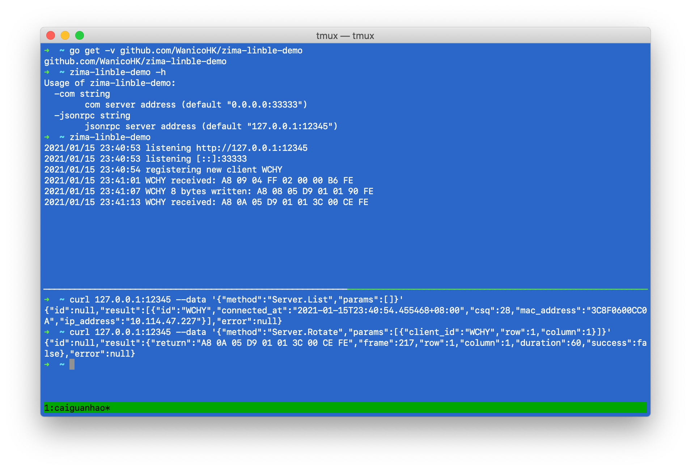
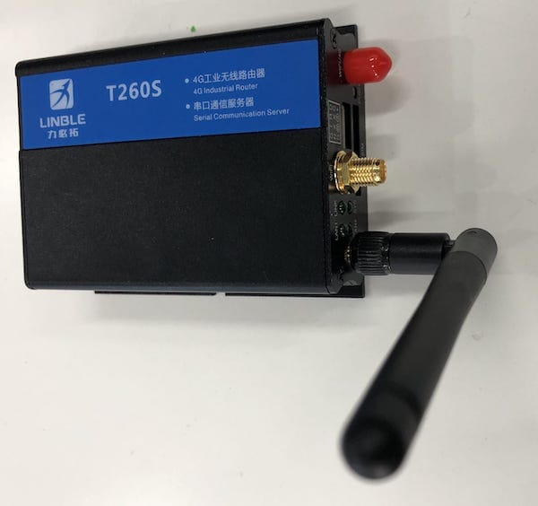
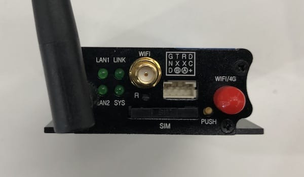
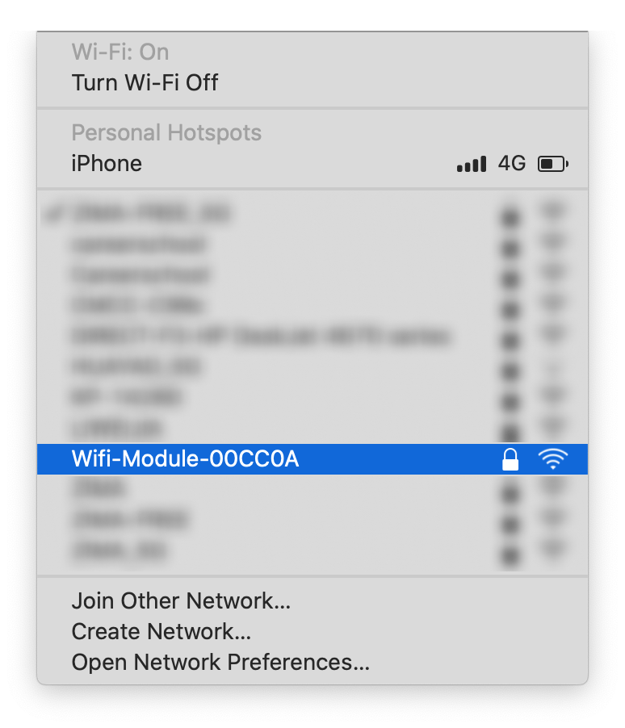
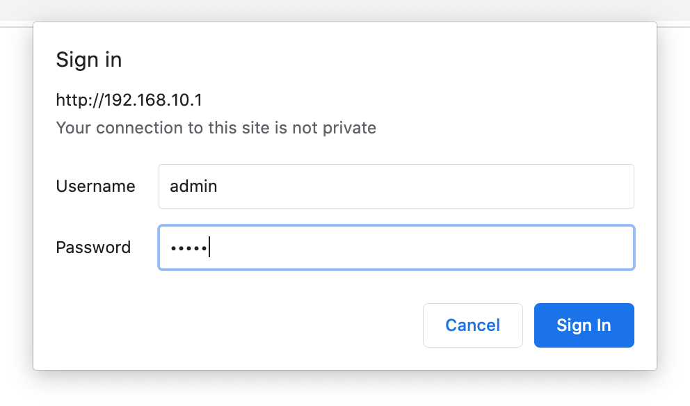
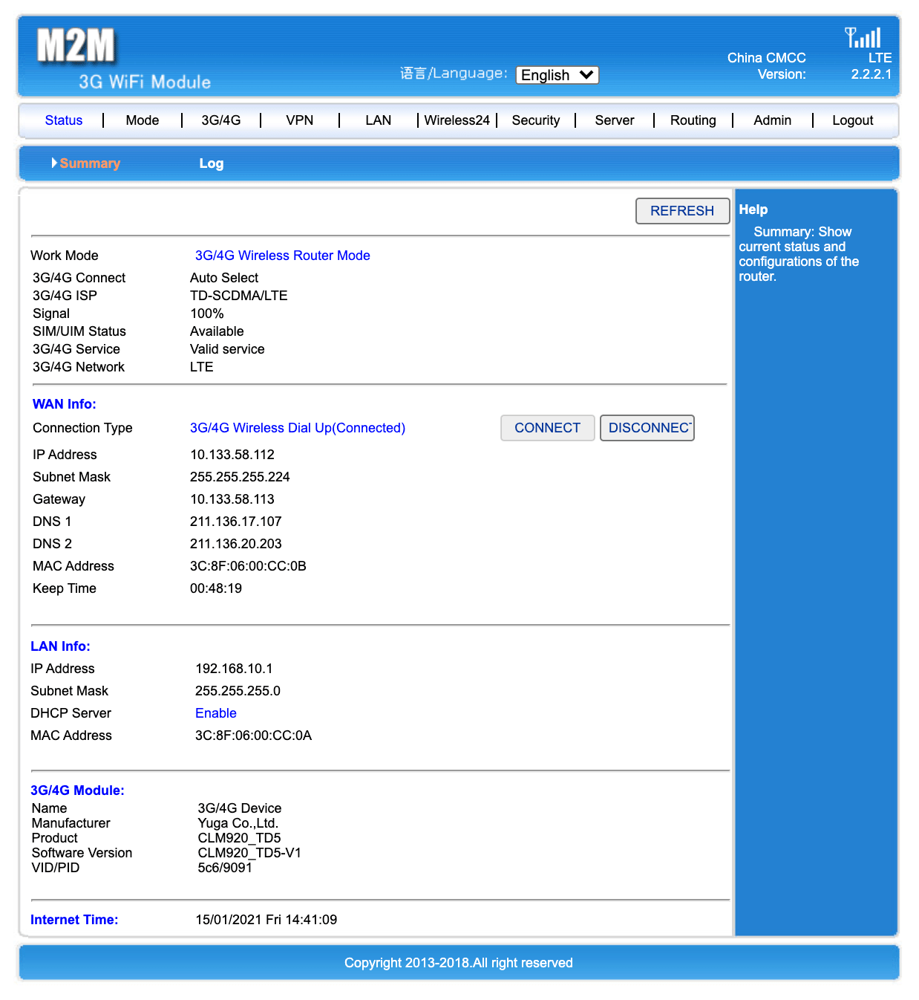
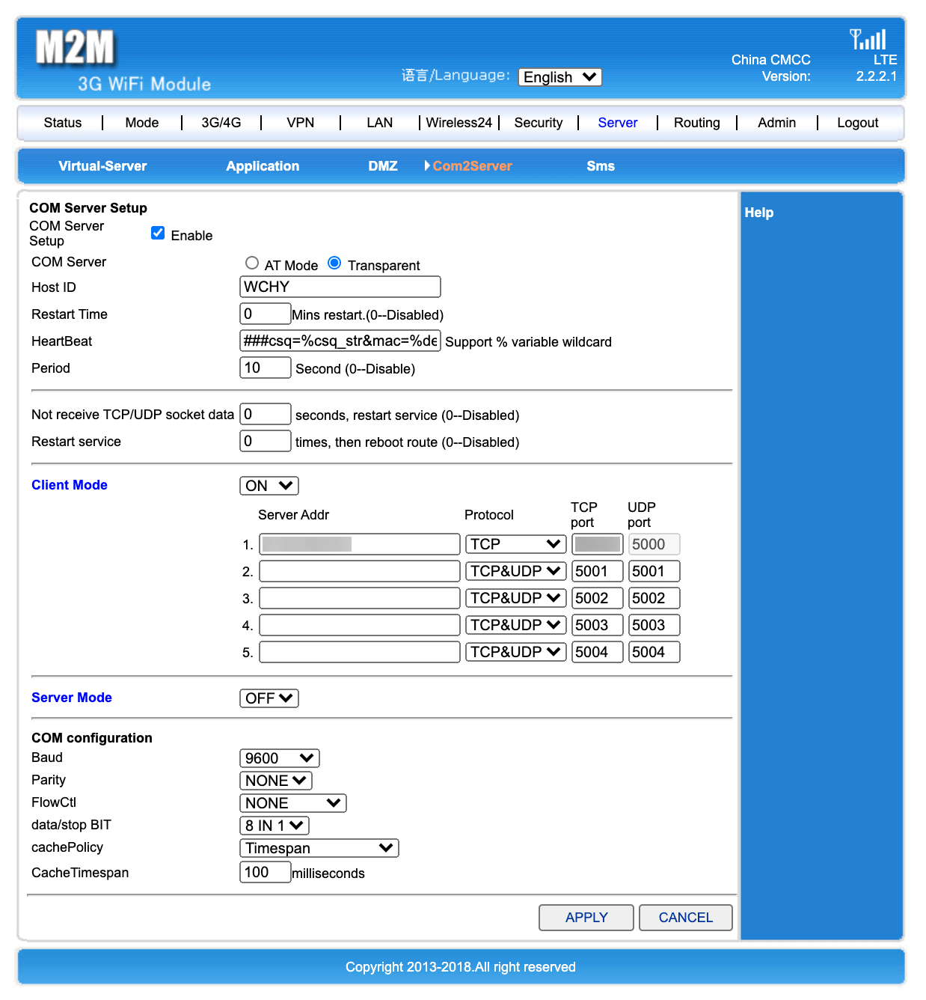
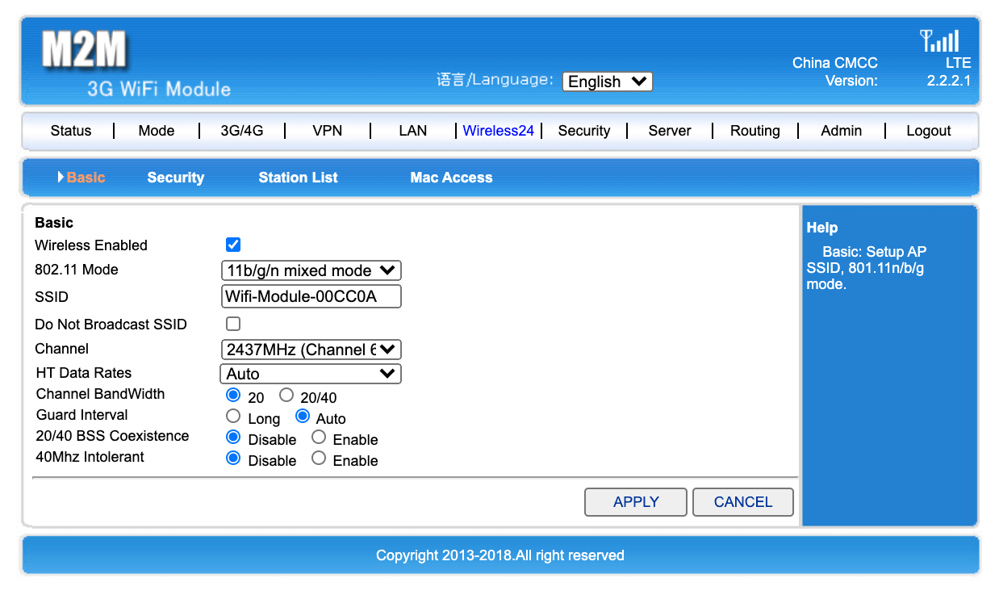

# zima-linble-demo

This is a demo of how to use Linble router to rotate a cell of a ZIMA slim vending machine.

## Demo

<br />
*zima-linble-demo running on Mac. See [Windows](./images/image-08.png).*

To run the demo server, you may need to [install Go](https://golang.org/dl/) for your Windows/Mac/Linux system first.

Open terminal (Mac/Linux) or Command Prompt (Windows) and enter this command to get the demo program:

```
go get -v github.com/WanicoHK/zima-linble-demo
```

If you don't have a server, you can use your computer as a server.
First, connect to the Linble router via Wifi. Log in to the router admin page and
set the Com2Server Server IP Address to your computer LAN address (for example, 192.168.10.100),
and port 33333 (default).

Run the demo server:

```
zima-linble-demo
```

To get list of clients:

```
curl 127.0.0.1:12345 --data '{"method":"Server.List","params":[]}'
```

To rotate a cell (1, 1) of a client:

```
curl 127.0.0.1:12345 --data '{"method":"Server.Rotate","params":[{"client_id":"WCHY","row":1,"column":1}]}'
```

Once the rotate command is sent, the vending machine motor rotates:

[](https://wanico.oss-cn-hongkong.aliyuncs.com/videos/video-00.mp4)<br />
*Click image to watch video*

## Protocol

### Request

This is an example of rotating cell at (1, 1):

|   |Constant|Size|Function|Frame|Data|Data|Checksum|Constant|
|-  |-       |-   |-       |-    |-   |-   |-       |-       |
|Hex|0xA8    |0x08|0x05    |0xD9 |0x01|0x01|0x90    |0xFE    |
|Dec|168     |8   |5       |217  |1   |1   |144     |254     |

Size = 4 (Constant + Size + Function + Frame) + 2 (Checksum + Constant) + Data Length

Function
|Function|Action|Data|Data|
|-       |-     |-   |-   |
|0x05    |Rotate a cell                         | row | column |
|0x09    |Unlock a cell                         | row | column |
|0x07    |Check before rotate or unlock a cell  | row | column |
|0x04    |Get status of refrigerator            | 2 | 2 |
|0x08    |Get replies of recent 5 calls         | 1 | 1 |

Frame: arbitrary number between 0 and 255

Data: see request data of the Function table above

Checksum: (Constant + Size + Function + Frame + Data...) & 0xff

Try here: https://play.golang.org/p/gDd3umTFWCl

### Response

This is an example of reply of rotating cell at (1, 1):

|   |Constant|Size|Function|Frame|Data|Data|Data|Data|Checksum|Constant|
|-  |-       |-   |-       |-    |-   |-   |-   |-   |-       |-       |
|Hex|0xA8    |0x0A|0x05    |0xD9 |0x01|0x01|0x3C|0x00|0xCE    |0xFE    |
|Dec|168     |10  |5       |217  |1   |1   |60  |0   |206     |254     |

After waiting maximum 6 seconds (0x3C), nothing dropped (0x00).

Size = 4 (Constant + Size + Function + Frame) + 2 (Checksum + Constant) + Data Length

Function and response data:
|Function|Action|Data|Data|Data|Data|
|-       |-     |-   |-   |-   |-   |
|0x05    |Rotate a cell                         | row | column | number of 1/10 seconds | 0x01 if rotated and passed fall-check) |
|0x09    |Unlock a cell                         | row | column | number of 1/10 seconds | 0x01 if successfully unlocked) |
|0x07    |Check before rotate or unlock a cell  | row | column | number of 1/10 seconds | 0x01 if success) |
|0x04    |Get status of refrigerator            | expected temp in °C | actual temp in °C | 0x01 if refrigerator is operating | - |

Note: function 0x08 will return replies of last 5 rotate and unlock calls.

Frame: same as the frame of the request

Data: see response data of the Function table above

Checksum: (Constant + Size + Function + Frame + Data...) & 0xff

## Linble router

Linble T260S 4G Router And Serial Communication Server may look like this:

 

## Setup

### Step 1

Plug in the power and wait for the machine to start up (it takes about one minute) until you find a Wifi network whose name starts with "Wifi-Module", connect to this network, and the password is "12345678". You can use a computer or mobile phone to connect.<br />
插入電源，等待機器啟動（需時約一分鐘），直至發現名稱以「Wifi-Module」開頭的 Wifi 網路，連上這個網路。你可以使用電腦或者手機進行連接。



### Step 2

Open http://192.168.10.1 in the browser and enter the user name "admin" and password "admin" to log in.<br />
在瀏覽器打開 http://192.168.10.1 ，輸入用戶名「admin」和密碼「admin」登入。



### Step 3

You can see the network connection status through the homepage.<br />
你可以透過首頁看到網路連接狀態。



### Step 4

Select "Server" and "Com2Server" to set the serial port.<br />
選擇「Server」和「Com2Server」設置串口。



<blockquote>
1. Enable "Com Server Setup".<br />
啟用「Com Server Setup」。<br />
<br />
2. Select "Transparent" for "COM Server".<br />
「COM Server」選擇「Transparent」。<br />
<br />
3. Enter your unique name in "Host ID", such as "TEST123".<br />
在「Host ID」輸入你的唯一名稱，如「TEST123」。<br />
<br />
4. Turn On "Client Mode"<br />
打開「Client Mode」<br />
<br />
5. Enter your server IP address in "Server Addr".<br />
在「Server Addr」中輸入你的伺服器 IP 位址。<br />
<br />
6. Enter your server IP address and port in "Server Addr" and "TCP Port".<br />
在「Server Addr」和「TCP Port」中輸入你的伺服器 IP 位址和連接埠。<br />
<br />
7. Select the appropriate Baud Rate in "Baud" of "COM configuration". The default Baud Rate of ZIMA machine is 115200.<br />
在「COM configuration」的「Baud」選擇合適的 Baud Rate 。ZIMA 機器的默認 Baud Rate 是 115200 。<br />
</blockquote>

### Step 5

For security reasons, it is recommended to change Wifi password or turn off Wifi after configuration.<br />
出於安全考慮，配置完畢後建議更改 Wifi 密碼或關閉 Wifi。


